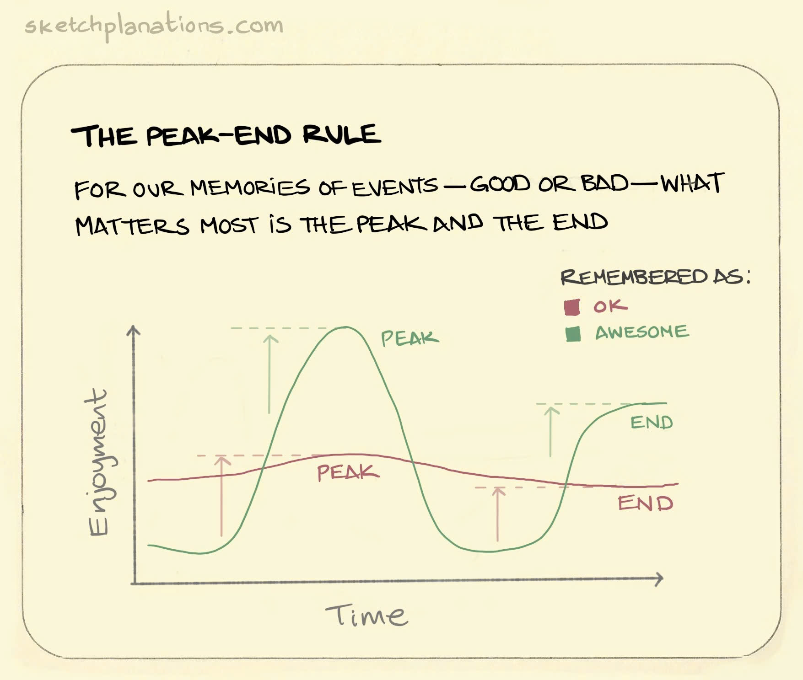

# AIsle Desktop Store Simulator

AIsle là hệ thống mô phỏng hành vi khách hàng trong cửa hàng tiện lợi. Dự án kết hợp dữ liệu quan sát từ video thực tế, ngữ cảnh cửa hàng, quần thể NPC sinh bằng Genetic Algorithm và Utility AI.

> **Trạng thái chuyển đổi:** hướng sản phẩm chính thức là Unity desktop application theo [`docs/Result_Plan.md`](docs/Result_Plan.md). Population foundation dùng GeneticSharp/Math.NET và C# Simulation Baseline đã hoàn thành local với invariant/statistical, .NET, Unity EditMode và web regression tests. UI/UX cùng các stage Interaction Zone/ORCA/Social/DOTS/Spine vẫn để giai đoạn sau. Web hiện tại được giữ làm baseline/reference.

Manager có thể thử nghiệm layout, vị trí kệ hàng, catalog và chính sách bán hàng trong môi trường mô phỏng trước khi áp dụng vào cửa hàng thật. Hệ thống tập trung vào khả năng quan sát, replay và giải thích nguyên nhân dẫn đến kết quả; không tự động tuyên bố một layout là “tối ưu”.

## Team: BlackBox AI

- **Phan Trung Kiên** — Core simulation.
- **Lê Bảo Khang** — Genetic Algorithm và NPC population.
- **Trần Đăng Khôi** — Trích xuất đặc trưng từ video thực tế.
- **Phạm Tài Nguyên** — UI/UX.
- **Đặng Hải Đăng** — UI/UX.

## Các module

- [thu-2](https://github.com/panno1vn/KADA-BLACK_BOX_AI-AIsle/tree/thu-2)
- [thu-4](https://github.com/panno1vn/KADA-BLACK_BOX_AI-AIsle/tree/thu-4)

## Lý thuyết nền tảng sản phẩm

Nhóm sử dụng **Peak–End Rule** làm một trong những lý thuyết nền tảng để thiết kế AIsle. Ký ức của khách hàng về một trải nghiệm chịu ảnh hưởng lớn bởi thời điểm cảm xúc mạnh nhất và trạng thái ở cuối hành trình.



Trong simulator:

- Mỗi NPC có trajectory cảm xúc trong suốt hành trình mua sắm.
- Tương tác tại shelf, sản phẩm hoặc ưu đãi có thể tạo peak valence.
- Checkout và thời điểm rời cửa hàng tạo thành trạng thái kết thúc.
- Replay và decision trace giúp xác định sự kiện tạo peak và nguyên nhân dẫn tới end state.
- Kịch bản có thể được nghiên cứu đồng thời theo doanh thu, trải nghiệm và retention proxy.

## Đối tượng sử dụng

- Manager các chuỗi cửa hàng tiện lợi như Circle K, GS25 và 7-Eleven.
- Chủ cửa hàng muốn kiểm tra phương án bố trí trước khi đầu tư triển khai.
- Nhóm phân tích hành vi khách hàng và hiệu quả kinh doanh.

### Chân dung người dùng chính

Người dùng trọng tâm của AIsle là quản lý hoặc chủ cửa hàng chịu trách nhiệm về layout, danh mục hàng hóa, ưu đãi và hiệu quả kinh doanh. Họ cần thử nhiều phương án với chi phí thấp, đồng thời phải nhìn thấy đường đi và quyết định của NPC để hiểu vì sao một kịch bản tạo ra kết quả cụ thể.

Các nhu cầu chính gồm:

- So sánh layout và chính sách trước khi áp dụng tại cửa hàng thật.
- Quan sát live simulation, replay, heatmap và decision trace thay vì chỉ nhận KPI cuối.
- Nhập thủ công hằng số, chỉ số và NPC cho các ca kiểm thử có kiểm soát.
- Đánh giá doanh thu cùng trải nghiệm khách hàng và khả năng quay lại.

Xem tài liệu [chân dung người dùng và kịch bản sử dụng](personal.md) để biết đầy đủ mục tiêu, pain points, job-to-be-done và tiêu chí thành công của sản phẩm.

## Bài toán

Việc thử trực tiếp một layout hoặc chính sách mới trong cửa hàng thật tốn thời gian, chi phí và có thể ảnh hưởng doanh thu. AIsle cung cấp một phòng thí nghiệm mô phỏng để trả lời các câu hỏi:

- Nên đặt từng nhóm sản phẩm ở đâu?
- Wall, lối đi, entrance và checkout ảnh hưởng thế nào đến luồng khách?
- Ưu đãi có làm tăng tỷ lệ mua hoặc impulse purchase không?
- Một phương án tăng doanh thu có làm giảm trải nghiệm cuối hành trình không?
- NPC chọn shelf vì nhu cầu, cảm xúc hay chi phí di chuyển?

## Luồng hoạt động

```text
Video khách hàng thật ─┐
                       ├─> Trích xuất đặc trưng và gắn nhãn
Ngữ cảnh cửa hàng ─────┘
                                  │
                                  ▼
                     Sinh quần thể NPC bằng GA
                                  │
                                  ▼
              Utility AI + A* + hard collision rules
                                  │
                                  ▼
               Chạy nhiều layout/chính sách thử nghiệm
                                  │
                                  ▼
          Live view, replay, history và decision trace
```

Shelf là smart object quảng bá category, sản phẩm và valence. NPC chấm utility theo attenuated need-delta, mức khám phá, cảm xúc và chi phí đường đi bậc hai. Lựa chọn trong top-K sử dụng weighted random có seed, giúp hành vi có biến thiên nhưng vẫn replay được.

## Tính năng chính

- Canvas editor cho wall, shelf, entrance và checkout.
- Wall có thể di chuyển, thay đổi đầu mút hoặc nhập tọa độ trực tiếp.
- Sinh 150–200 NPC bằng GA hoặc nhập NPC thủ công bằng CSV.
- Poisson spawn theo đường cong lưu lượng có seed.
- Utility AI, cảm xúc, main purchase và impulse purchase.
- A* pathfinding không xuyên wall/shelf, có stuck recovery và abandon target.
- Event `phantom-need`, `unreachable`, `replan` và decision trace.
- Run, Pause, Reset, Single Step, timeline và nhiều tốc độ chạy.
- Live KPI: doanh thu, conversion, purchases và nhu cầu ngoài catalog.
- Export chuẩn `aisle.sim-result.v1`.
- Trajectory replay đầy đủ cho từng NPC.
- History API để lưu, liệt kê và đọc lại simulation run.

## Chạy ứng dụng

### Unity desktop app — hướng chính thức

Yêu cầu:

- Windows.
- Node.js 22 trở lên.
- Không cần cài npm package.

Nhấp đúp:

```text
run-desktop.bat
```

## Kế hoạch tương lai

### Kết nối với hệ thống cửa hàng thật

AIsle hiện dừng ở mức mô phỏng offline: input là video đã xử lý sẵn, không có luồng cảm biến/camera thời gian thực nào chạy song song với cửa hàng thật. Hướng đã phác trong `docs/Result_Plan.md` (mục Video Reality Analytics) là một tầng "Reality Bridge" tách biệt, không chạy chung tiến trình với simulation core: Detection (RT-DETR/YOLOX) → Tracking (ByteTrack) → Homography calibration → `aisle.observation.v1` → so sánh với `SimResult`.

Để đánh giá hướng này khả thi tới đâu, nhóm tham khảo **Just Walk Out của Amazon** — công nghệ checkout-free thương mại đã triển khai quy mô lớn nhất hiện nay:

- **Cơ chế**: camera gắn trần + cảm biến trọng lượng (load-cell) trên từng ngăn kệ, kết hợp computer vision và sensor fusion để xác định ai lấy sản phẩm nào. Từ 7/2024, Amazon huấn luyện hệ thống trên bản đồ 3D của cửa hàng cùng catalog ảnh sản phẩm để rút ngắn thời gian triển khai cho cửa hàng mới.
- **Độ chính xác**: thất thoát do trộm cắp dưới 1% ở các cửa hàng tuân thủ đúng quy trình vận hành (6/2024–5/2025).
- **Bài học quan trọng cho AIsle**: Amazon đã **gỡ Just Walk Out khỏi chính chuỗi Amazon Fresh** (định dạng siêu thị lớn) trong năm 2024, chuyển sang Dash Cart — không phải vì công nghệ sai, mà vì khách mua giỏ hàng lớn muốn thấy tổng tiền, ưu đãi và số tiền tiết kiệm ngay trong lúc mua sắm, chứ không chỉ "đi ra là xong". Ngược lại, Amazon vẫn tiếp tục mở rộng Just Walk Out theo hướng B2B cho bên thứ ba, tăng hơn gấp đôi số cửa hàng **định dạng nhỏ** dùng công nghệ này chỉ trong 2024, đạt hơn 360 điểm triển khai tới 2025–2026.
- Kết quả này **khớp trực tiếp với đối tượng người dùng AIsle đã chọn** (Circle K, GS25, 7-Eleven — cửa hàng tiện lợi, giỏ hàng nhỏ, mua nhanh) chứ không phải mô hình siêu thị lớn: nếu tích hợp phần cứng thật, hướng checkout-free kiểu Just Walk Out phù hợp với đúng phân khúc AIsle đang nhắm tới hơn là với giỏ hàng lớn.


